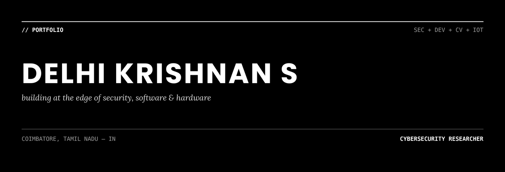

 

building at the edge of security, software and hardware

 

---

### 01 — STACK

Mostly Python and JavaScript day to day. On the security side: `nmap`, `burp suite`, `metasploit`, `wireshark`, `nuclei`, `splunk`. For building things: `django` / `react` / `node` + `express`, backed by `firebase` or `postgres`. The AI/CV side runs on `opencv`, basic `CNN` / `SVM` models, and sentence-BERT for NLP work. Daily driver is Kali on Linux, Ubuntu on the Pi boards.

 

---

### 02 — BUILDING NOW

**[NIGHTFALL](https://github.com/DELHIKRISHNAN/NIGHTFALL)** — an agentic penetration testing platform that reasons through recon, triage and exploitation instead of running a fixed script.

Also maintaining **[ZORO](https://github.com/DELHIKRISHNAN/zoro_framework)**, a web security scanner for authorised testing, and a drone-based crop monitoring rig on a Raspberry Pi 5 + Pixhawk.

 

---

### 03 — EXPERIENCE

**Nanvi Technologies** — Software Development Intern

Built an AI resume analyzer using Sentence-BERT for resume-to-job-description matching (~92% accuracy), with OCR for parsing scanned/PDF resumes. Django backend, React frontend. Cut manual screening time by roughly 70%.

`Django` `React` `Sentence-BERT` `OCR` `REST API`

 

---

### 04 — PROJECTS

<table>
<tr><td width="33%">

**[NIGHTFALL](https://github.com/DELHIKRISHNAN/NIGHTFALL)**
Agentic pentesting platform — recon, triage, exploit.
`Python` `AI Agents`

</td><td width="33%">

**[ZORO Framework](https://github.com/DELHIKRISHNAN/zoro_framework)**
Modular web security scanner for authorised audits.
`Python` `OWASP`

</td><td width="33%">

**[Resume Screening Portal](https://github.com/DELHIKRISHNAN/Resume-Screening-Portal)**
Matches resumes to job descriptions, flags gaps.
`Sentence-BERT` `Django` `React`

</td></tr>
<tr><td width="33%">

**[NDVI Crop Drone](https://github.com/DELHIKRISHNAN/ndvi-crop-monitoring-drone)**
Aerial + ground sensing for precision agriculture.
`Raspberry Pi` `OpenCV`

</td><td width="33%">

**[Smart Water Management](https://github.com/DELHIKRISHNAN/S-W-M-Portal)**
Household water usage dashboard, Firebase-backed.
`Node` `Firebase`

</td><td width="33%">

**[Microplastic Detector](https://github.com/DELHIKRISHNAN/MICROPLASTIC_DETECTOR)**
CV pipeline detecting microplastics (~86% accuracy).
`Python` `CNN` `SVM`

</td></tr>
<tr><td width="33%">

**[URISS](https://github.com/DELHIKRISHNAN/URISS)**
Compact underwater ROV for search & rescue.
`Python` `Robotics`

</td><td width="33%">

**[Incubation Portal](https://github.com/DELHIKRISHNAN/INCUBATION-PORTAL)**
Platform for managing a startup incubation cohort.
`HTML` `CSS` `JS`

</td><td width="33%"></td></tr>
</table>

---

### 05 — AWARDS & CERTIFICATIONS

**Awards**
- TUM Germany — Global Sustainability Challenge, top performer (EUR 1,400)
- CISCO thingQbator, Cohort 8 winner — Rs. 5,00,000 seed funding (CISCO × NASSCOM Foundation)
- Siemens Design Challenge 2026, top performer (Siemens × Sony)
- Smart India Hackathon 2025 — finalist
- IIT Madras / IIT PALS InnoWAH — Rs. 10,000 award

**Certifications**
- Python Essentials I & II — Cisco Networking Academy
- CCNA (Networking & Enterprise Security) — Cisco Networking Academy
- Apply AI: Analyze Customer Reviews — Cisco Networking Academy

---

### 06 — ACTIVITY

The snake below eats one contribution square per frame, in date order — so it visibly **grows a new segment every time it clears a square**, and shrinks again once the trail outruns its length. It's styled as a black-to-white gradient so it matches the rest of the page instead of GitHub's default green.

---

### 07 — CONTACT

Open to internships, security roles and full-stack work.

 

---

