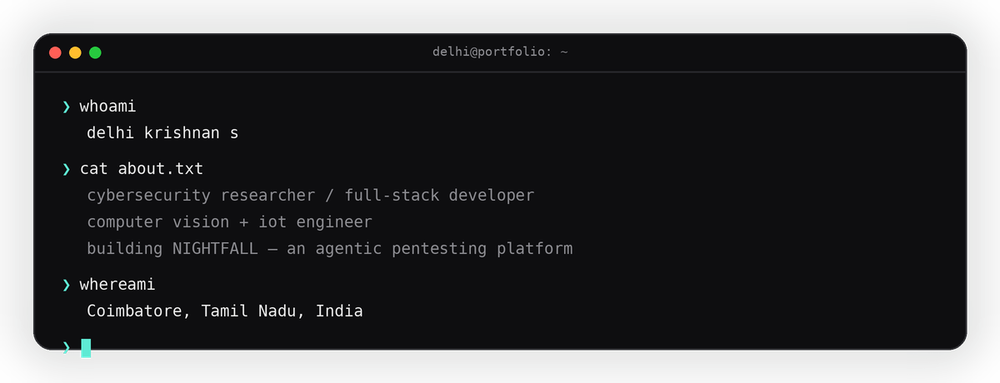
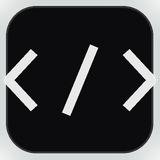
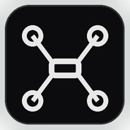
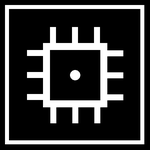
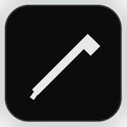

 

 

Coimbatore, Tamil Nadu — building things that sit somewhere between security, software and hardware. Currently finishing a B.Tech in Computer Science & Business Systems, and spending most of my free time on **NIGHTFALL**, an agentic pentesting tool.

 

---

### what i work with

Mostly Python and JavaScript day to day. On the security side that's `nmap`, `burp suite`, `metasploit`, `wireshark`, some `nuclei` and `splunk` for the blue-team stuff. For building things I reach for `django` / `react` / `node` + `express`, usually with `firebase` or `postgres` behind it. The AI/CV work leans on `opencv`, basic `CNN` / `SVM` models, and sentence-BERT for anything NLP-flavoured. Daily driver is Kali on top of Linux, sometimes Ubuntu on the Pi boards.

 

---

### currently building

**[NIGHTFALL](https://github.com/DELHIKRISHNAN/NIGHTFALL)** — an agentic penetration testing platform that reasons through recon, triage and exploitation instead of running a fixed script.

Also maintaining **[ZORO](https://github.com/DELHIKRISHNAN/zoro_framework)**, a smaller web security scanner for authorised testing, and tinkering with a drone-based crop monitoring rig on a Raspberry Pi 5 + Pixhawk.

 

---

### experience

**Nanvi Technologies** — Software Development Intern

Built an AI resume analyzer using Sentence-BERT for resume-to-job-description matching (~92% accuracy), with OCR for parsing scanned/PDF resumes. Django backend, React frontend. Cut manual screening time by roughly 70%.

`Django` `React` `Sentence-BERT` `OCR` `REST API`

 

---

### projects

| Project | What it does | Stack |
|---|---|---|
| [NIGHTFALL](https://github.com/DELHIKRISHNAN/NIGHTFALL) | Agentic pentesting platform — recon, triage, exploit | Python, AI agents |
| [ZORO Framework](https://github.com/DELHIKRISHNAN/zoro_framework) | Modular web security scanner for authorised audits | Python, OWASP |
| [Resume Screening Portal](https://github.com/DELHIKRISHNAN/Resume-Screening-Portal) | Matches resumes to job descriptions, flags gaps | Sentence-BERT, Django, React |
| [NDVI Crop Monitoring Drone](https://github.com/DELHIKRISHNAN/ndvi-crop-monitoring-drone) | Aerial + ground sensing for precision agriculture | Raspberry Pi, OpenCV |
| [Smart Water Management](https://github.com/DELHIKRISHNAN/S-W-M-Portal) | Household water usage dashboard, Firebase-backed | Node, Express, Firebase |
| [Microplastic Detector](https://github.com/DELHIKRISHNAN/MICROPLASTIC_DETECTOR) | CV pipeline for detecting microplastics in water samples (~86% accuracy) | Python, CNN, SVM |
| [URISS](https://github.com/DELHIKRISHNAN/URISS) | Compact underwater ROV for search & rescue | Python, robotics |
| [Incubation Portal](https://github.com/DELHIKRISHNAN/INCUBATION-PORTAL) | Platform for managing a startup incubation cohort | HTML, CSS, JS |

---

### awards

- TUM Germany — Global Sustainability Challenge, top performer (EUR 1,400)
- CISCO thingQbator, Cohort 8 winner — Rs. 5,00,000 seed funding (CISCO × NASSCOM Foundation)
- Siemens Design Challenge 2026, top performer (Siemens × Sony, immersive design track)
- Smart India Hackathon 2025 — finalist
- IIT Madras / IIT PALS InnoWAH — Rs. 10,000 award

### certifications

- Python Essentials I & II — Cisco Networking Academy
- CCNA (Networking & Enterprise Security) — Cisco Networking Academy
- Apply AI: Analyze Customer Reviews — Cisco Networking Academy

---

### github stats

### contribution snake

> If this section is blank: the snake workflow hasn't run yet. See the setup note at the very bottom of this file.

---

### get in touch

Open to internships, security roles and anything full-stack.

 

---

**Snake animation setup:** put `snake.yml` at `.github/workflows/snake.yml` in this repo → Settings → Actions → General → Workflow permissions → "Read and write permissions" → run it once manually from the Actions tab → it creates an `output` branch with the SVGs this README points to.
